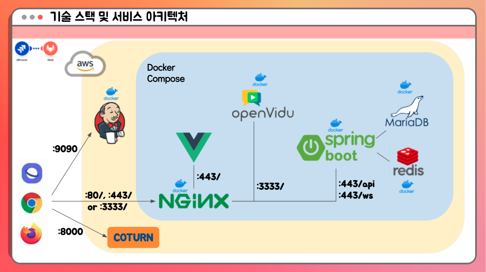

#  SSAFIA
화상으로 즐기는 마피아 게임
https://ssafia.r-e.kr/home
<br>

## 👩‍👩‍👧‍👦 팀원 소개
#### 🧑‍💻 <strong>유태규</strong> - 팀장, FE
#### 🧑‍💻 <strong>김지훈</strong> - BE
#### 🧑‍💻 <strong>김용훈</strong> - BE
#### 🧑‍💻 <strong>이현정</strong> - BE
#### 🧑‍💻 <strong>최은송</strong> - FE

<br>

## 📝 프로젝트 개요 
* <strong>진행 기간</strong>: 2021.07.12 ~ 2021.08.20
* <strong>목표</strong>
  * 플레이어는 음성과 영상을 통해 서로 소통하며, 오프라인으로만 즐기던 마피아 게임을 온라인으로 즐길 수 있습니다.
  * 어플리케이션을 설치하지 않고도 웹 브라우저로 간편하게 접속해 어디서든 SSAFIA를 이용할 수 있습니다.
  * 회원가입을 하지 않아도 구글 로그인만 하면 쉽게 방을 생성할 수 있습니다.
  * URL로 친구들을 초대하면 로그인의 번거로움 없이 게임을 즐길 수 있습니다. 
  * 재미있는 애니메이션과 사용자 친화적인 UI/UX를 설계해 게임의 몰입감을 높입니다.
  <br>


## ✍️ 프로젝트 소개 
<strong>SSAFIA</strong>는 온라인으로 마피아 게임을 즐길 수 있는 화상 기반 마피아 웹 게임입니다.

코로나 19 바이러스로 인해 언택트 시대에 들어서며 랜선으로 할 수 있는 게임, 회식, 놀이, 수다 문화 등의 인기가 높아졌습니다. 현재까지는 ZOOM이나 웹엑스 등의 기존 화상채팅 도구를 이용하여 게임을 했습니다. 그러나 미팅 기능에 초점이 맞춰진 어플리케이션에서는 게임 진행에 한계가 있었습니다. 그래서 <strong>"SSAFIA"</strong>는 마피아 게임 기능에 초점을 맞춘 화상 채팅 서비스를 제공하고자 합니다. 

### 게임 규칙

- 인원 수에 따른 직업 분배
  - <strong>최소 4인</strong>이 갖춰져야 게임 시작 가능
  - 4인의 경우 특수직업 없이 마피아 1, 시민 3으로 시작
  - 5인의 경우 특수직업 의사 추가, 의사1, 마피아1, 시민3으로 시작
  - 6인부터는 특수직업 의사와 경찰 모두 등장, 의사1, 경찰1, 마피아 (인원수//3), 시민 (나머지)로 시작

- 승리조건 
  - 마피아의 경우: 시민의 수가 마피아와 같아지면 게임 승리
  - 시민, 의사, 경찰의 경우: 모든 마피아를 제거하면 게임 승리, 혹은 제한된 턴이 15턴 안에 게임이 끝나지 않을 경우 승리

- 투표 규칙
  - 투표의 종류는 크게 3가지
    - `낮 투표`: 살아있는 모든 사람이 참가할 수 있는 투표로 여기서 최다득표자는 최종투표 후보가 됨
    - `최종 투표`: 최종투표 후보자를 제거할지 아닐지를 정하는 투표
    - `밤 투표`: 시민의 제외한 마피아, 경찰, 의사가 하는 투표로 각각의 직업마다 다른 효과를 지님
      - 마피아: 동료끼리 소통해 시민을 제거할 수 있음
      - 경찰: 투표한 사람의 직업을 알 수 있음
      - 의사: 투표한 사람은 이번 밤 투표에서 살릴 수 있음
  - 모든 투표는 아래와 같은 규칙을 따름
    - 각 페이즈별 남아있는 시간동안 마음껏 투표대상을 바꿀 수 있으며, 내가 한 투표를 취소할 수도 있음
    - 기본적으로 투표하지 않는다면 이는 무효표를 던진 것으로 간주
    - 낮 투표는 유기명 투표로 자신이 누구에게 투표했는지를 실시간으로 반영
    - 밤 투표의 경우 마피아끼리만 자신이 누구에게 투표했는지를 실시간으로 반영
    - 무효표와 동률에 관한 조항
      - 기본적으로 무효표가 과반이 넘어가면 그 투표는 무효로 처리하고 다음 페이즈로 넘어간다.
      - 낮 투표에서 생존자가 5인 이하일경우 2명, 생존자가 6인 이상일경우 3명까지 최종투표 후보에 올라갈 수 있다.
      - 밤투표와 최종투표의 경우 동률이 나오면 투표결과를 무효로 처리하고 진행한다.

### 게임 FLOW
1. `시작`: 각 플레이어는 자신의 직업이 무엇인지 받아보게 됩니다.
2. `낮 투표`: 각 플레이어는 의심스러운 사람을 투표 할 수 있습니다.
3. `최종 투표`: 최종 변론자는 주어진 시간 동안 변론하게 됩니다. 나머지 플레이어는 최종 변론자에게 <strong>KILL/SAVE</strong> 투표합니다. 낮 투표가 무효처리될 경우 스킵됩니다.
4. `최종 투표 결과 발표`: 최종 투표 결과를 확인합니다.
5. `밤 투표`: 의사, 마피아, 경찰은 각각 투표를 진행하게 됩니다.
6. `밤 투표 결과 발표`: 의사, 마피아, 경찰의 투표 결과를 확인합니다.
7. `사망 시`: 사망시 <strong>관전자 모드</strong>가 되어 오디오와 비디오가 강제로 꺼집니다. 관전자는 모든 플레이어의 오디오와 비디오를 볼 수 있으며 직업 또한 알 수 있습니다.
8. `종료`: 어느측이 승리했는지를 발표하게 되며, 대기 상태로 다시 돌아가게 됩니다.

<br>

## 💡 주요 기능 
### 회원가입 없이 구글 로그인으로 방 생성
> SSAFIA는 회원가입을 따로 하지 않아도 기존 구글 아이디로 로그인하면 바로 방을 만드실 수 있습니다.


* 게임 모드를 선택하고, 닉네임을 입력하면 방을 생성할 수 있습니다
* 방장은 url을 통해 친구를 초대할 수 있습니다.


### 화상 미팅 기능
> openvidu를 활용해 화상채팅을 구현했습니다. 플레이어들은 대화를 통해 싸피아 게임을 플레이할 수 있습니다.


- 동시에 말할 때 헷갈리지 않도록 현재 말하는 사람이 누구인지 표시됩니다.


### 마피아 게임  기능

> 실제 친구들과 모여서 하던 것처럼 말하고, 투표하고, 정치할 수 있습니다.
- webSocket을 이용해 마피아 게임 기능을 구현했습니다.


- 밤에 마피아들은 고개를 들어 누굴 제거할 지 고민했던 것 처럼 싸피아에서도 똑같은 체험을 할 수 있습니다.

- 투표기능
  - 투표하고 싶은 사람을 클릭하면 투표하실 수 있습니다.
  - 제한시간 안에는 투표를 바꿀수도 있고 취소할 수 있습니다.
  - 더 이상 바꿀 마음이 없다면 투표확정 버튼을 클릭해 확정할 수 있습니다.


- 관전기능
  - 사망 시, 아무 역할 없이 게임이 진행되는 것을 보기만 하는 것이 아니라, 다른 사람들의 직업이 무엇인지 무슨 얘기를 하고 있는지 들을 수 있습니다.
- 비디오 온오프 기능
  - 진짜 모여서 마피아를 하는 것처럼 밤이 되면 다른 사람의 영상이나 오디오를 듣지 못하게 되고, 특정 사람들끼리만 확인할 수 있도록 됩니다.

<br>


## ⚙️ 기술 스택 




- frontend
  - vue 3.1.5
  - vuex 4.0.2
  - vue-router 4.0.10
  - sockjs-client 1.5.1, webstomp-client 1.2.6
- backend
  - MariaDB 10.4.20
  - redis 6.2.4
  - spring Boot 2.5.2
- 화상미팅 관련
  - openvidu-browser 2.19.0
  - openvidu 2.19.0
- 배포
  - aws
  - nginx
  - jenkins

<br>

## 🏑 conventionss
### commit message convention
- algular commit message convention 
  - type(scope): short summary
  - type 종류
    - feat : 새로운 기능 추가
    - fix : 버그 수정
    - docs : 문서 관련
    - style : 스타일 변경 (포매팅 수정, 들여쓰기 추가, …)
    - refactor : 코드 리팩토링
    - test : 테스트 관련 코드
    - build : 빌드 관련 파일 수정
    - ci : CI 설정 파일 수정
    - perf : 성능 개선
  - short summary
    - 마침표 쓰지 않기
    - 한글 영문, 모두 가능

### git branch convention

- master - develop - feature
- 개인 개발한 것들은 모두 feature/기능 브랜치에서 수행
- 프론트와 백에서 asignee로 지명된 이들이 심사후 develop으로 merge
- master에 merge할 경우 팀원 모두 모여서 회의 후 진행


<br>

## 🌐 배포 방법
[frontend/src/constant/prod.js](./frontend/src/constant/prod.js)에서 올바른 도메인 이름으로 변경합니다.

WebRTC를 사용하기 때문에 STUN/TURN 서버가 필요합니다.

오픈 소스 프로젝트인 [coturn](https://github.com/coturn/coturn)을 설치하는 방법은 다음과 같습니다
```sh
sudo apt-get update && sudo apt-get install --no-install-recommends --yes coturn
```

`/etc/default/coturn`의 내용을 다음과 같이 수정합니다.
```sh
TURNSERVER_ENABLED=1
```

`/etc/turnserver.conf`의 내용을 다음과 같이 수정합니다.
```sh
listening-port=3478
tls-listening-port=5349
listening-ip=<EC2의 프라이빗 IPv4 주소>
external-ip=<EC2의 퍼블릭 IPv4 주소>/<EC2의 프라이빗 IPv4 주소>
relay-ip=<EC2의 프라이빗 IPv4 주소>
fingerprint
lt-cred-mech
user=myuser:mypassword
realm=myrealm
log-file=/var/log/turn.log
simple-log
```

coturn을 재기동합니다.
```
sudo service coturn restart
```

다음 명령어를 통해 coturn의 상태를 확인할 수 있습니다.
```
sudo systemctl status coturn
```

배포를 하기 위해서는 서버에 docker와 docker-compose가 설치되어 있어야 합니다.  
docker는 [공식 웹페이지에 나와 있는 debian에서의 설치 방법](https://docs.docker.com/engine/install/debian/#install-using-the-repository)으로 설치하면 되고, docker-compose는 apt-get 명령어를 통해 설치가 가능합니다.

프로젝트의 root 위치에서 docker-compose를 실행하면 빌드 및 배포까지 자동으로 이루어집니다.
```sh
docker-compose up -d
```

단, docker-compose를 실행하기 위해서는 `prod.env` 파일이 필요합니다. `prod.env`의 내용은 다음과 같습니다.
```env
# backend
GOOGLE_CLIENT_ID=1q2w3e4r-1q2w3e4r.apps.googleusercontent.com
GOOGLE_CLIENT_SECRET=4r3e2w1q4r3e2w1q
SPRING_DATASOURCE_USERNAME=a104
SPRING_DATASOURCE_PASSWORD=a1041234
JWT_SECRET=1q2w3e4r
#OPENVIDU_URL=https://<service domain name>:3333/
OPENVIDU_URL=https://openvidu:3333/
APP_BASE_URL=https://<service domain name>

# openvidu
KMS_STUN_IP=<coturn server ip>
KMS_STUN_PORT=3478
KMS_TURN_URL=myuser:mypassword@<coturn server ip>:3478?transport=udp
DOMAIN_OR_PUBLIC_IP=<service domain name>

# backend & openvidu
OPENVIDU_SECRET=MY_SECRET

# mysql
MYSQL_USER=a104
MYSQL_PASSWORD=a1041234
MYSQL_ROOT_PASSWORD=a1041234
```

### 첫 배포시 주의 사항
첫 배포시에는 [init-letsencrypt.sh](./init-letsencrypt.sh)을 실행시켜 certbot에 의해 SSL/TLS 인증서를 생성하도록 해야 합니다.

init-letsencrypt.sh 내용에서 `domains`와 `data_path`, `email`을 알맞게 수정한 뒤 실행시키면 됩니다.


### 배포시 주의 사항
redis/redis-data와 mysql/mysql-data는 각각 redis container와 mysql(mariadb) container의 데이터 저장 directory를 mount하고 있으니 각별히 주의해야 합니다.

