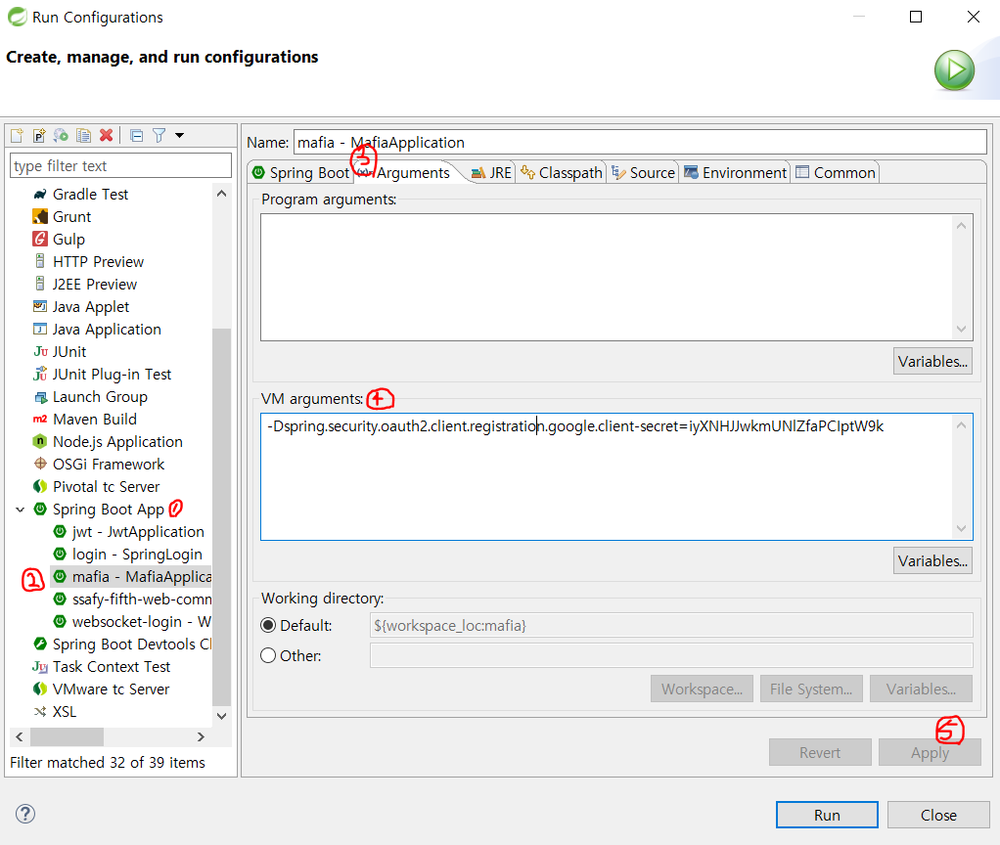
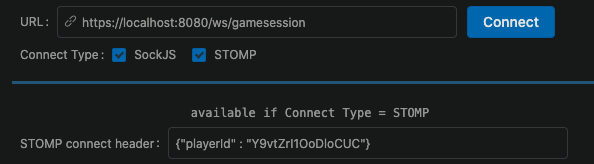
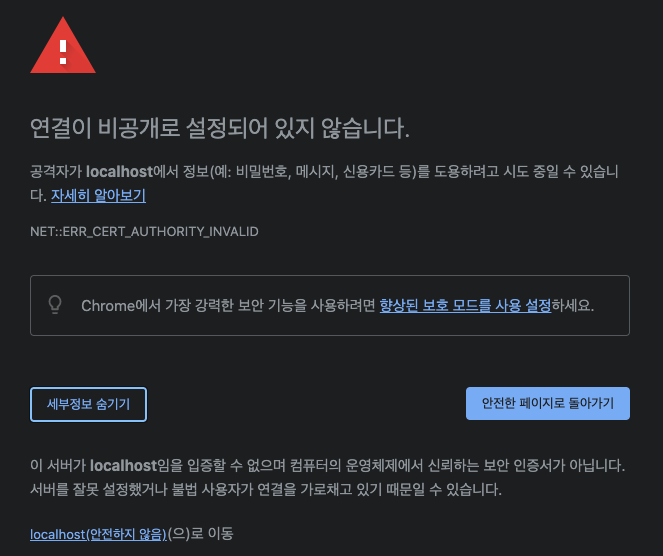
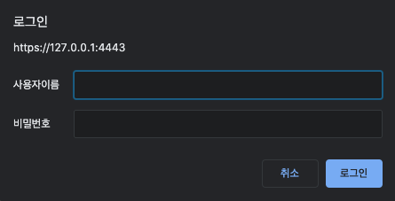
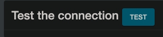
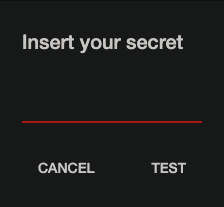

# :back: Backend


## 🔧 개발 환경

- Google Chrome Browser
- STS, IntelliJ
- Java (openjdk 1.8)
- Spring Boot v2.5.2
- mariaDB v10.4.20, JPA
- redis v6.2.4, redisson
- openvidu v2.19.0
- SockJS, Stomp
- docker


## :pray: Code Style

- google code style
  - 특징
	- indentation : 2 spaces
	- colmun limit : 100
  - IDE 적용 방법
    - [eclipse 적용](https://github.com/google/styleguide/blob/gh-pages/eclipse-java-google-style.xml)
    - [intellij 적용](https://github.com/google/styleguide/blob/gh-pages/intellij-java-google-style.xml)
  - check style plugin 활용
    - [check style config xml](config/checkstyle/google_checks.xml) ([reference](https://github.com/checkstyle/checkstyle/blob/master/src/main/resources/google_checks.xml)에서 일부 수정하여 프로젝트에 적용) 


## :bulb: 주요 기능​

### 소셜 로그인

- 구글 소셜 로그인 API 사용
- user 정보를 암호화하여 jwt 토큰에 담아 클라이언트에게 전달


### 화상 미팅

- openvidu를 이용한 화상 미팅 구현
- openvidu를 통해 session 생성
- sessionId를 roomId로 활용하고 tokenId를 playerId로 활용


### 방 정보 저장

- key-value 데이터 구조를 가지는 redis를 이용해 방 정보를 메모리에 저장

- 방 정보를 빠르게 조회 가능
- redis의 동시성 문제를 해결하기 위해 redisson을 통한 분산 lock 이용


### 투표 정보 저장

- player 투표를 redis에 저장
- redis의 동시성 문제를 해결하기 위해 개인의 투표를 따로 저장함
- server에서 방의 투표자 목록을 별도로 관리


### 게임 정보 전달

- 실시간 메시징 서비스를 구현하기 위해 SockJS와 Stomp 사용
  - endpoint: /ws/gamesession
  - publisher prefix: /pub
  - subscriber prefix : /sub
- redis pub/sub 기능을 통해 서버 내부에서 phase가 변해야하는 시점이라고 알리는 event trigger 구현


### 게임 시간 관리

- 각 phase마다 정해진 시간이 있고 정해진 시간이 지났을 때 phase 변할 수 있도록 서버에서 시간 관리
- Timer의 schedule 메서드를 사용해 어떤 일(task)을 언제 실행하면 되는지 설정
  - `timer.schedule(task, task가 실행 될 시간)`


## :lollipop: local 개발 방법

### client-secret 적용
client-secret 적용 방법에는 2가지가 있다.

- IDE VM argument 설정(STS)

  1. run -> Run Configurations

  2. Spring Boot App -> mafia -> Arguments -> VM arguments에 아래와 같이 작성 -> Apply

     ```
     -Dspring.security.oauth2.client.registration.google.client-secret=4r3e2w1q4r3e2w1q
     ```

     


- 환경 변수 설정
`GOOGLE_CLIENT_SECRET`으로 환경 변수를 설정하면 된다


### 환경 구축

- DB
local에서는 mysql 또는 mariadb를 사용하면 되고, schema는 `mafia` 이름으로 생성해주면 된다.


- openvidu
[run-environment-for-backend.sh](../script/run-environment-for-backend.sh)을 통해 openvidu docker container를 실행하면 된다.

- redis
  - 설치 및 실행
  [run-environment-for-backend.sh](../script/run-environment-for-backend.sh)을 통해 redis docker container를 실행하면 된다.

  - redis-cli 사용 방법
  [run-redis-cli.sh](../script/run-redis-cli.sh)을 통해 redis container의 redis-cli를 실행할 수 있다.

  - redis-cli 명령어

    ```sh
    keys * # 모든 key 조회
    hgetall "GameSession:V1234" # GameSession V1234의 모든 field 조회
    hget "GameSession:V1234" hostId # GameSession V1234의 hostId field 조회
    del "GameSession:V1234:idx" # GameSession V1234의 idx 제거 (단, 해당 key만 제거)
    hgetall "Vote" # 모든 플레이어들의 투표 상태 조회
    hget "Vote" playerId # playerId의 투표 상태 조회
    flushall # 모든 key 제거
    ```


## :memo: STOMP local 테스트 방법

- <https://jxy.me/websocket-debug-tool/>에 접속한다
- 이미지와 같이 connect header에 'playerId' 항목을 입력하고 'Connect' 버튼을 누른다

- 설정되어 있는 subscribe destination('/sub')에 맞게 subscribe를 한다
- 설정되어 있는 send destination('/pub')에 맞게 Send를 한다


## :exclamation: known error

### 방에 입장했을 때 openvidu session 연결이 안 되는 경우
openvidu 서버가 self signed 인증으로 되어 있기 때문에 broswer 입장에서 openvidu 서버의 주소가 안전하지 않다고 판단하여 접근을 막는다.  
따라서, openvidu 서버의 주소인 https://localhost:4443/dashboard에 browser로 접속하여 다음과 같은 경고가 뜨더라도 계속 진행한다.



ID와 PW를 입력하여 로그인을 한다.


- default ID : OPENVIDUAPP
- default PW : MY_SECRET

다음과 같이 'Test' 버튼을 클릭한다.




Openvidu의 secret key를 입력한다(default값은 보통 `MY_SECRET` 이다).




## 📈 프로젝트 구조 (폴더만)

```
- MafiaApplication.java

- api
	- advice
	- controller (RestController)
	- request (api 형식에 맞춘 requset 객체들)
	- response (api 형식에 맞춘 response 객체들)
	- service

- common
	- exception
	- response
	- util

- config (redis, security, websocket 등 Configuration 파일)

- domain
	- dao
	- entity
	- enums
	- mapper
	- repository

- redispubsub (redis pub/sub 기능에 필요한 객체들)
	- message

- security (구글 로그인에 jwt 토큰, handler 등)
	- oauth2
		- user

- stomp
	- controller(MessageMapping이 필요한 Controller)
	- Interceptor
	- request (message의 request 형식 객체들)
	- response (message의 response 형식 객체들)
	- service
	- task (정해진 시간 이후 실행할 task)
```

