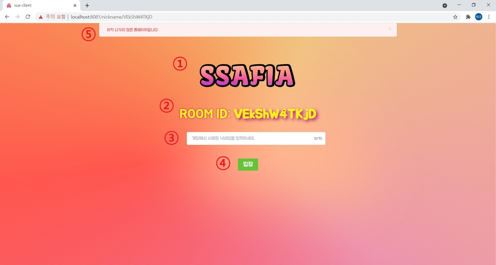

# 시연 시나리오

## 1. 소셜 로그인

1. ③번 클릭하여 구글 로그인
   - script: 저희 SSAFIA는 접근을 쉽게 하기 위해 회원가입을 거칠 필요 없이, 단순히 구글 계정으로 로그인만 해도 즐길 수 있게 되어있습니다.
2. ②번 클릭하여 방 생성 페이지로 이동
   - script: 이렇게 로그인을 하고 나면 방 생성 페이지로 이동할 수 있게 됩니다.

## 2. 방생성

- ②번 박스 안의 버튼들을 클릭하여 방 설정
  - script: 안타깝게도 현재 SSAFIA에서 지원하는 방 설정은 친구들과 함께, 기본 모드로 하는 것뿐입니다. 추후에 업데이트될 수도 있으니 기대해주세요

## 3. 닉네임 설정

- ③번을 클릭후 닉네임 입력
  - script: 저희 SSAFIA는 아주 단순한 규칙 3~15자 내의 닉네임이기만 하면 쓸 수 있도록 되어있습니다. 자유롭게 닉네임을 결정해주세요
- ④번을 클릭후 게임 입장
  - script: 닉네임이 괜찮다고 판단이 내려지면 이제 본격적으로 게임을 할 수 있는 화면으로 넘어가게 됩니다.

## 4. 마피아게임 

- 자신이 호스트이고 참가자가 4명 이상일 경우 ②번을 눌러서 게임 시작
  - script: 제가 호스트니까 제가 게임 시작을 눌러보도록 하겠습니다.
- 페이즈 변화시마다 ④에 문구가 바뀌므로 이를 보고 어떤 행동을 해야될지 선택
  - script: 제 직업이 마피아라고 하는군요. 마피아는 이런 것들을 하면 된다고 합니다.
- 투표가 가능한 페이즈에는 ⑤번과 같이 화상 화면이 나오는 카드를 눌러 투표 진행
  - script: 화상 화면에 마우스를 올리니까 클릭이 가능한 것처럼 되네요. 오 누르니까 제가 투표했다고 표시가 뜨네요
- 투표를 더 이상 변경할 생각이 없을 시 ②번 위치에 새로 나오는 투표 확정 버튼 혹은 무효표 버튼을 눌러 투표 결과 확정
  - script: 아직은 단서가 별로 없어서 그냥 무효표를 던지는 것도 괜찮아보입니다.
  - script: 아무리 봐도 이 사람이 마피아같으니까 그냥 투표 확정 하겠습니다.
- 자세한 룰에 대해 알고싶을 시 ③번 버튼을 눌러 룰북 확인
  - script: 아까 넘어갔던 이유가 마피아 룰이 이러했기 때문이군요.

