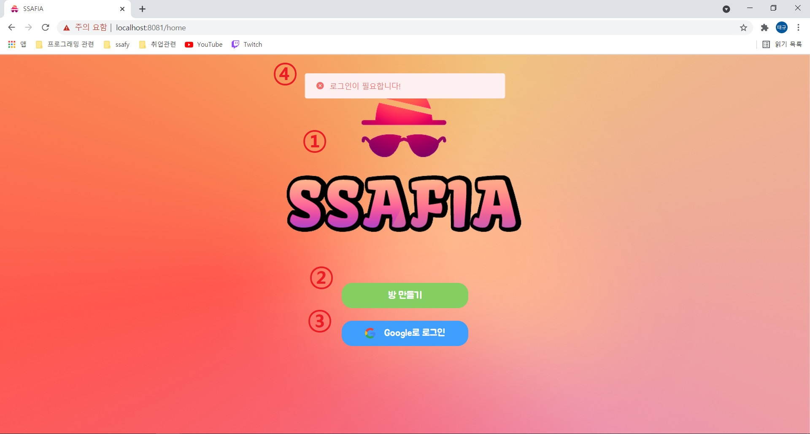
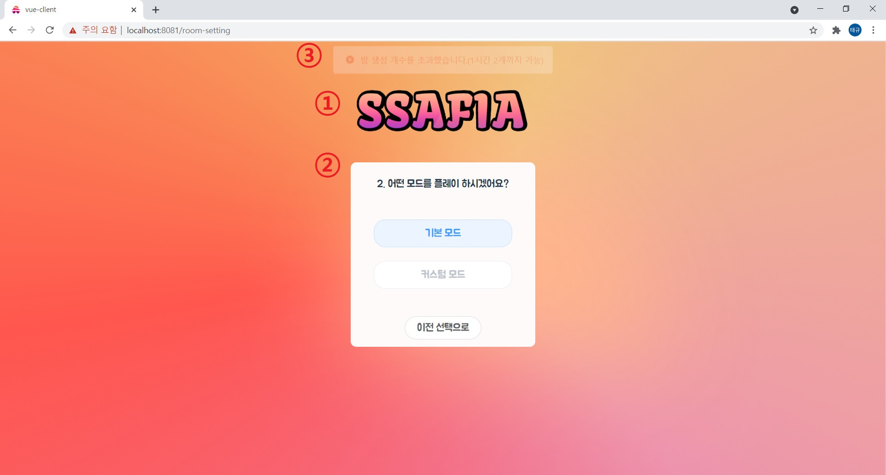
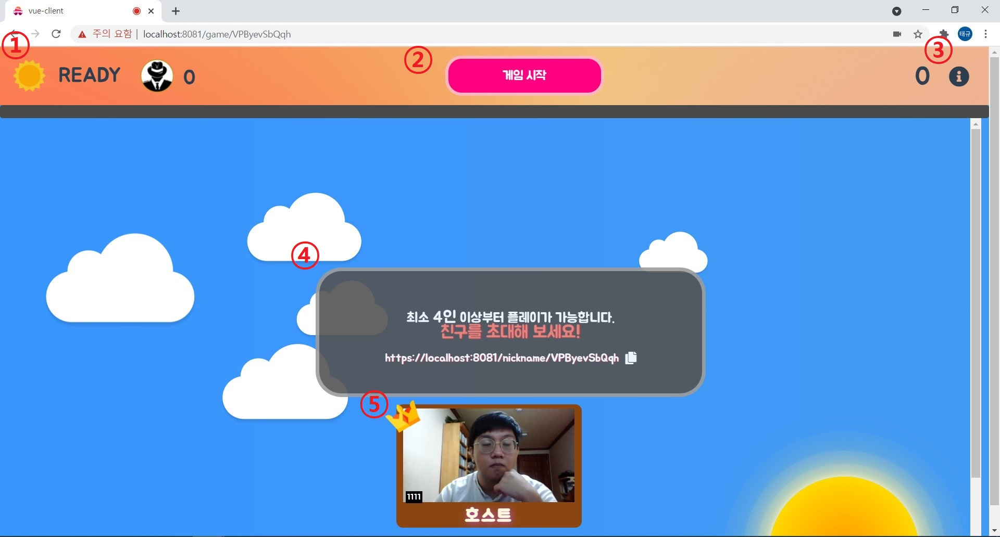
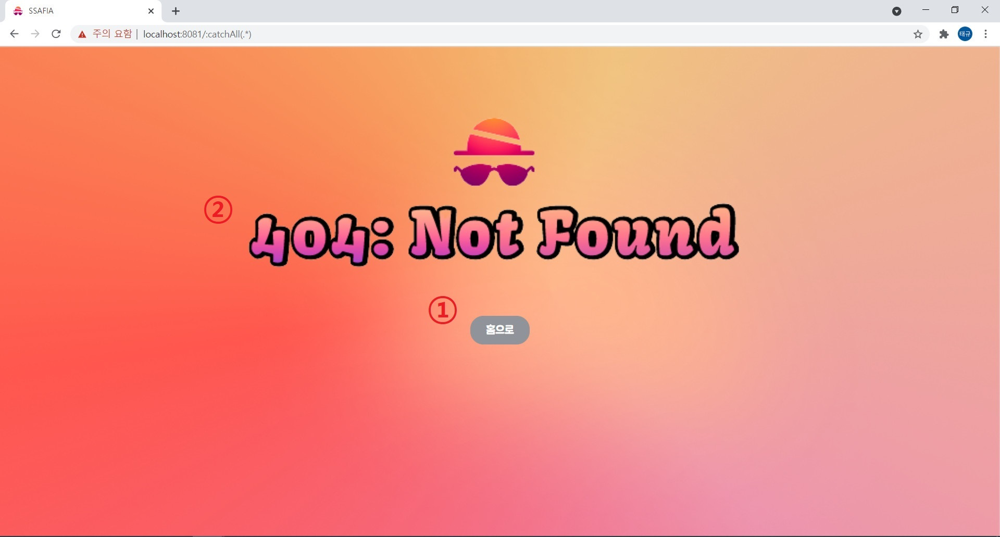

# Frontend

> 최초 생성: 2021.07.22
> 최종 수정: 2021.08.17
>
> 팀장: 유태규
> 팀원: 김영주, 최은송

<br>

## 🔧 개발 환경

- Google Chrome Browser
- Visual Studio Code
- HTML5, CSS3, JavaScript(ES6)
- [Bootstrap5](https://getbootstrap.com/docs/5.0/getting-started/introduction/), [Element Plus 1.0.2-beta.55](https://element-plus.org/#/en-US)
- [Animista](https://animista.net/)
- [Vue.js v3.1.5](https://v3.ko.vuejs.org/)
- [openvidu](https://openvidu.io/)
- SockJS, Stomp

<br>

## 🔑 실행 방법

- 프로젝트 셋업

```
npm i
```

- 개발자 모드 실행

```
npm run serve_dev
```

- 사용자 모드 실행

```
npm run serve_prod
```

- 빌드 파일(dist) 개발자 환경 변수로 생성

```
npm run build_dev
```

- 빌드 파일(dist) 사용자 환경 변수로 생성

```
npm run build_prod
```

<br>

## 📈 프로젝트 구조

```
- App.vue

- assets
	- fonts
	- images

- router
	- router.js

- store
	- modules
	- index.js
	- mutation-types.js

- common
	- css
		- common.css
		
- constant(각종 환경변수 및 상수들)

- views
	- home (홈)
		- Home.vue
		- components
		  - Login.vue
	
	- game (게임)
		- Game.vue
		- components
			- Navbar.vue
			- Background.vue
			- UserVideo.vue
			- OvVideo.vue
			- RuleBook.vue
	
	- room-setting (방 세팅)
		- Room-setting.vue
	
	- nickname (닉네임 설정)
		- Nickname.vue
	
	- error (에러)
		- 404.vue
```

<br>

##  화면별 설명
### 홈 화면



1.  사이트 로고: 클릭하면 홈화면으로 이동할 수 있습니다.
2.  방 만들기 버튼: 로그인 후 방 만들기 버튼을 클릭하면 방을 생성할 수 있습니다.
3.  로그인 버튼: 클릭하면 구글 로그인을 할 수 있습니다.
4.  에러 메세지: 어떤 동작때문에 에러가 발생했는지 알려줍니다.

### 방 생성 화면



1.  사이트 로고: 클릭하면 홈화면으로 이동할 수 있습니다.
2.  설정 폼: 내부의 버튼들을 클릭하여 만들려는 방의 설정을 정할 수 있습니다. 현재 친구들과 기본 모드로 하는 것만 지원됩니다.
3. 에러 메세지: 방 설정시에 문제가 있으면 어떤 문제가 있는지 알려줍니다.

### 닉네임 설정 화면


1.  사이트 로고: 클릭 시 홈화면으로 이동할 수 있습니다.
2.  room id: 현재 진입하려고 하는 방의 room id를 확인할 수 있습니다.
3.  닉네임 입력 칸: 사용하려고 하는 닉네임을 써넣을 수 있습니다. 3~15자 사이여야 합니다.
4.  입장 버튼: 닉네임이 유효할 경우 클릭하면 게임 화면으로 이동할 수 있습니다.
5.  에러 메세지: 어떤 이유로 에러가 발생했는지 알려줍니다.

### 게임 화면



1.  네비게이션 바: 게임의 상태와 관련된 정보들이 표시되는 곳입니다. 며칠째 진행중인지와 남아있는 마피아 수, 이번 페이즈의 시간이 얼마나 남았는지 등을 확인할 수 있습니다
2.  네비게이션 바 버튼: 게임과 관련된 것들을 선택할 수 있는 곳입니다. 호스트일 경우 게임을 시작할 수 있으며, 투표가 가능한 페이즈일 경우 투표를 확정할 수 있습니다.
3.  룰 북 버튼: 클릭 시 이 웹 사이트에서 사용중인 마피아 룰에 대해 상세히 읽어볼 수 있습니다.
4.  안내 메세지 창: 게임이 진행됨에 따라 직업 별 해야할 일 및 공통적으로 해야하는 일에 대한 안내 문구가 표시됩니다. 특수 직업의  경우 추가적인 메세지도 나올 수 있습니다.
5.  플레이어 박스: 사람들의 화상화면이 나오는 곳입니다. 게임이 시작되면 이 박스를 클릭하여 투표를 진행하게 됩니다. 한 번 클릭시 투표, 다시 한번 클릭시에는 투표 취소가 가능합니다. 

### 404 에러 화면



1.  홈 버튼: 클릭 시 홈화면으로 이동하게 됩니다.
2.  에러 메세지: 어떤 종류의 에러가 난 것인지를 알려줍니다. 이 경우 사용자가 찾고자 하는 것을 찾을 수 없을 때 일어나는 에러입니다. 

## 📘 관련 문서

- [와이어 프레임](https://www.figma.com/file/D946y8Vykt2jgYXgHfmGDM/%EB%A7%88%ED%94%BC%EC%95%84%EA%B2%8C%EC%9E%84---%EC%99%80%EC%9D%B4%EC%96%B4-%ED%94%84%EB%A0%88%EC%9E%84?node-id=0%3A1)
- [Airbnb JavaScript Style Guide](https://github.com/airbnb/javascript)
- [Vue JS Style Guide](https://kr.vuejs.org/v2/style-guide/index.html)

